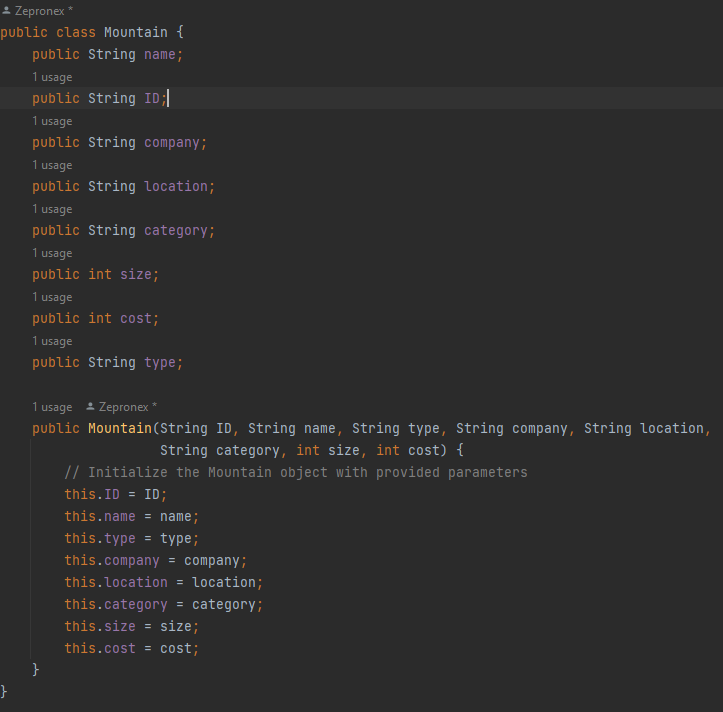
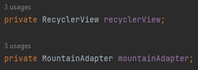
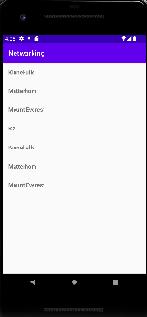

# Rapport

I started off by forking the app "networking" and cloning it to Android Studios.
In order to display the data, I added a RecyclerView to my layout. Then, i created
a Mountain class to hold values for the mountains (name, location etc) which looks 
like this: .Thereafter I added ArrayList<Mountain> and RecyclerView.
Adapter as member variables of my activity, which is created like this:  
in the MainActivity class. Then, I created a RecyclerView.Adapter and RecyclerView.ViewHolder 
as well as use getJson to download the json data. Lastly i troubleshooted and made minor changes
so that the application displays the names of mountains in the RecyclerView and wrote the report.
The final result looks like this: .

The onPostExecute() method is an important part of your project as it handles the processing 
and updating of the JSON data retrieved from the server. Here is what it looks like:

@Override
public void onPostExecute(String json) {
Log.d("MainActivity", json);
if (json != null) {
try {
// Parse the JSON response
JSONArray jsonArray = new JSONArray(json);
for (int i = 0; i < jsonArray.length(); i++) {
JSONObject jsonObject = jsonArray.getJSONObject(i);

                    // Extract data from JSON object
                    String name = jsonObject.getString("name");
                    String ID = jsonObject.getString("ID");
                    String type = jsonObject.getString("type");
                    String company = jsonObject.getString("company");
                    String location = jsonObject.getString("location");
                    String category = jsonObject.getString("category");
                    int size = jsonObject.getInt("size");
                    int cost = jsonObject.getInt("cost");

                    // Create a new Mountain object and add it to the list
                    mountainList.add(new Mountain(ID, name, type, company, location, category, size, cost));
                }

                // Notify the adapter that the data has changed
                mountainAdapter.notifyDataSetChanged();

            } catch (JSONException e) {
                e.printStackTrace();
            }
        }
    }